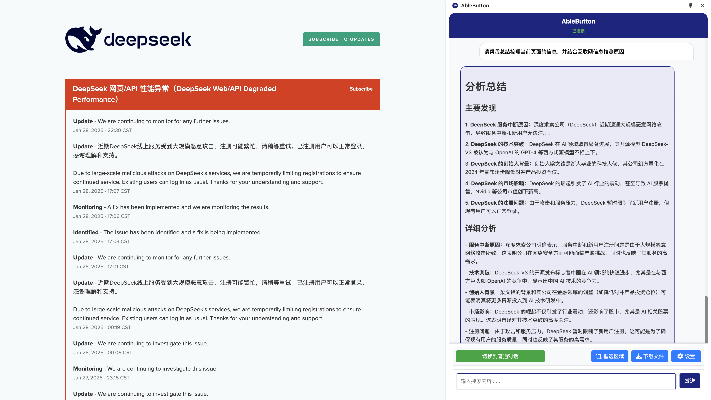

# AbleButton-DeepSeek

AbleButton 是一个智能的 Chrome 扩展，它可以帮助你分析网页内容、执行搜索和处理文件。它默认使用 DeepSeek API 来提供智能对话功能，旨在于提供api应用场景，降低使用门槛。

## 功能特点

- 友好支持DeepSeeK 的AI 模型（deepseek-chat, deepseek-reasoner）
- 智能网页内容分析
- 自定义搜索和分析
- Token 使用统计
- 可自定义的 API 设置

## 功能对比

- 支持对当前打开页面作为上下文进行实时内容查看（页面需加载完毕）
- 点击支持联网搜索，通过程序预处理，和AI进行配合生成本地检索任务，通过自主打开搜索引擎进行搜索
- 对比google 的 Gemini AI 的两个模型 Gemini 2.0 Pro和Flash付费版本，对于页面的提问和总结效果，该程序在使用deepseek-chat v3 时已经能体现优势，且对中文支持更友好。
- DeepSeek API费用低廉，通过api进行访问稳定性更高。




## 安装

1. 克隆仓库：
```bash
git clone https://github.com/hanlinlibham/ablebutton-deepseek.git
```

2. 在 Chrome 浏览器中：
   - 打开 `chrome://extensions/`
   - 启用"开发者模式"
   - 点击"加载已解压的扩展程序"
   - 选择项目目录

## 配置

1. 获取 DeepSeek API Key：
   - 访问 [DeepSeek Platform](https://platform.deepseek.com/)
   - 注册账号并获取 API Key
   - 可免费获取10元额度，用于5,000,000tocken

2. 配置扩展：
   - 点击扩展图标
   - 打开设置页面
   - 输入你的 API Key
   - 选择要使用的模型
   - 配置其他参数（温度、最大 token 等）

## 使用说明

1. 基本使用：
   - 点击扩展图标打开侧边栏
   - 输入问题或选择文本后右键使用
   - 查看 AI 响应和分析结果

2. 模型选择：
   - deepseek-chat：适合一般对话
   - deepseek-reasoner：适合需要推理的任务 #不稳定，还在查询原因

3. Token 统计：
   - 在设置页面查看 token 使用情况
   - 包括上传、下载和总计统计


## 贡献

欢迎提交 Pull Request 或创建 Issue。

## 许可证

本项目采用 MIT 许可证 - 详见 [LICENSE](LICENSE) 文件。 
